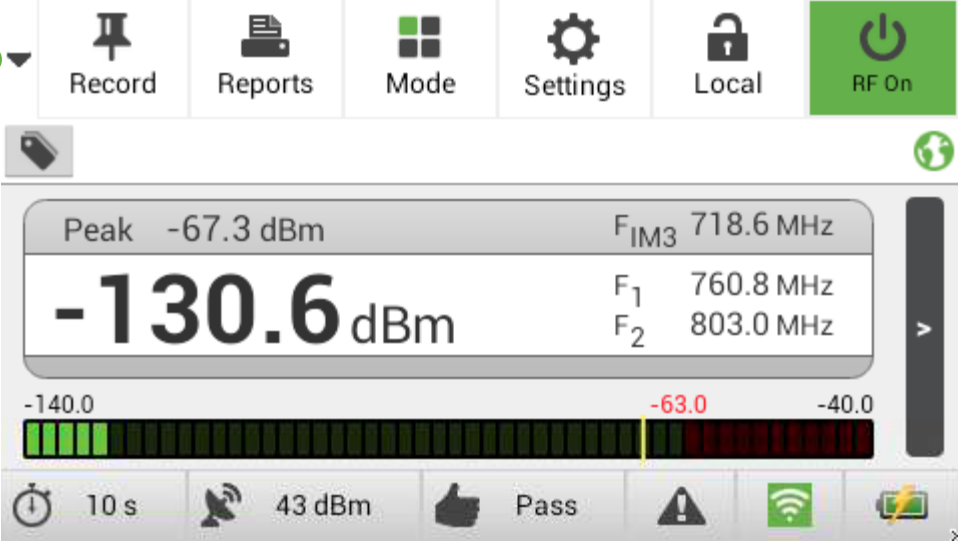

I was part of the team that developed the original bench-top passive intermodulation
distortion analyzer (i.e., "PIM Analyzer") and later became the Director of
Engineering for Summitek Instruments, the world leader in PIM instrumentation.

<!-- end -->

At the dawn of the wireless cellular revolution (circa 1990), companies were starting
to deploy huge networks of cellular basestations which were used to provide the link
between their customer's mobile phones and the telephone network.

The key components in wireless basestations are the antennas used to transmit and
receive the signals from the subscribers' phones, and it turned out that the quality
of these antennas was critical to the optimum performance and revenue generating
capability of the basestations. Poorly designed or incorrectly assembled transmit
antennas would generate a type of harmonic distortion that would directly block
the relatively small signals from handsets in the basestation's area. Dropped calls
due to this effect meant a significant hit to revenue.

Intermodulation distortion caused by the passive device (i.e., the antenna) was
the culprit, but antenna manufacturers had no easy and standardized means to test
their antennas for the distortion. In 1998 I was part of the team at Summitek
Instruments that created and sold the first complete Passive Intermodulation Distortion
Analyzers. These so-called PIM Analyzers were turnkey boxes that could measure and
analyze antennas (as well as other passive devices) in a rapid enough manner that
the test could become part of the manufacturing production line. It soon became
the world standard that antennas to be used in wireless basestations be tested on
Summitek equipment to show their PIM quality.

Although I was intimately familiar with the entire PIM analyzer, its operation and
capabilities, I was the engineer in charge of developing the instrument's user
interface. I developed a robust control API for the instrument and used my software
design experience to create a very intuitive interface for a relatively complex
device.

Over the years, the original Summitek Instruments PIM analyzer evolved and combined
with another company's mobile version of the test set. Summitek Instruments and
Triasx became Kaelus, and I developed the user interface for their mobile PIM analyzer,
the iPA. The iPA relied on the same underlying principles of PIM measurement, but
used a more modern interface. Users could operate the device from its built
in screen, or from any web-connected device such as their computer, tablet, or smart
phone. I built the interface to work on any of these devices while preserving
the simplicity and capabilities of the original interface.
