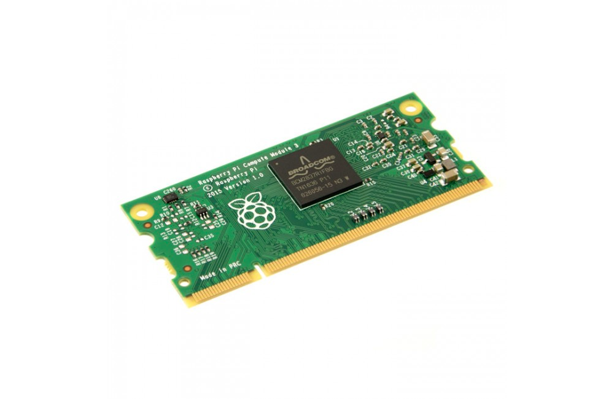

TracVision started life as a new product development focused on bringing IoT monitoring 
and control capabilities to medical facility power conditioners.

<!-- end -->

The primary constraint on the project was to build an extremely low-cost solution,
including all manufacturing processes and labor.  The product had to fit within a large
range of existing equipment with varying form factors while still being available for
new original equipment manufacturers.  Finally, TracVision was envisioned to develop
into a platform solution for a family of related products, and thus it had to support
future expandability of sensors, transducers, actuators, and communication channels and
protocols.

I chose to base the TracVision's control system on the extremely popular and inexpensive
Raspberry Pi line of single board computers (SBC's). The Raspberry Pi Compute Module
is the industrial version of the computer and was extremely robust in specification
while staying extremely low cost.

The Raspberry Pi supports a large number of open source Linux based operating systems,
and I chose a compact distribution based on the popular Debian system.  Under the hood,
I created a system of Python programs that functioned as the system monitor, application
programming interface (API), and sensor module driver.

I built TracVision with a number of unique and modern features to fulfill its purpose
as a low-cost IIoT device:

* a containerized application layer based on the popular Docker architecture that supported
in-place software updates distributed via the internet and a recovery mode base image.

* a modern web interface developed with Javascript and React featuring encrypted and authenticated
access restrictions using tabbed interfaces, real-time graphical plots, and 

* a Git-based CI/CD build system that implemented robust unit and integration testing
and automated deployment of the software to the production facility.

